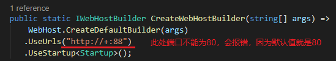

## ASP.NET Core Web应用容器化

```
*前请确保已经有正常的Docker环境、本地已经安装了.NET Core SDK[此处为2.2]，这里是部署在Windows Server 2016上的Docker*
```


#### 创建项目，确保项目正常运行

```powershell
##创建项目
dotnet new mvc -au Individual -uld false --name CoreWeb

##进入项目根目录
cd CoreWeb

##编译项目
dotnet build

##运行项目，正常运行即可
dotnet run
```

####项目根目录创建DockerFile文件,EXPOSE端口那里要注意!!!

> ******
>
> [docker hub上的aspnetcore官方镜像最下面有段话](https://hub.docker.com/r/microsoft/aspnetcore)，内容如下
>
> ------
>
> #### A note on ports
>
> This image sets the `ASPNETCORE_URLS` environment variable to `http://+:80` which means that if you have not explicity set a URL in your application, via `app.UseUrl` in your Program.cs for example, then your application will be listening on port 80 inside the container.
>
> 翻译过来意思是：`此镜像将ASPNETCORE_URLS环境变量设置为http：// +：80，这意味着如果您没有明确地在应用程序中设置URL，例如通过Program.cs中的app.UseUrl，那么你的应用程序将在端口上侦听 80在容器内。`
>
> ------
>
> **什么意思呢，也就是说，如果你没有在Asp.Net Core项目的Program.cs设置`UseUrl("ip+port")`，打包镜像并运在容器上时，Asp.Net Core 应用的将默认运行在容器的80端口，因此，在写DockerFile的时候，EXPOSE的端口，必须是80，用`docker run`命令运行容器的时候，也必须用80端口和容器主机的端口做映射，否则应用将无法访问，当然如果你天生骄傲，不喜欢用别人定的东西，也可以自己改，除了在Program.cs里设置`UseUrl("ip+port") `如下图，也可以在DockerFile里配置端口，写法大概是： `ENV ASPNETCORE_URLS=http://+:88`，不过后面一种方法我尝试失败了，可以自己试试。**
>
> 

```dockerfile
# 拉取sdk镜像，以便使用dotnet命令
FROM microsoft/dotnet:2.2-sdk as build

# 限定工作目录
WORKDIR /code

# 开放80端口
EXPOSE 80

# 复制文件到code目录
COPY CoreWeb.csproj /code

# restore程序 
RUN dotnet restore

#拷贝文件到code
COPY . /code

# 发布应用到out文件夹
RUN dotnet publish -c Release -o out

# 拉取runtime镜像
FROM microsoft/dotnet:2.2-aspnetcore-runtime

# 创建工作目录app
WORKDIR /app

# 从发布文件夹cout拷贝到app
COPY --from=build /code/out /app

# 运行dll文件
ENTRYPOINT [ "dotnet","CoreWeb.dll" ]
```

#### 创建镜像

```powershell
 docker build -t web:prod . 
 # web:prod 镜像名称和Tag .表示当前目录
 # 打包镜像步骤执行完毕后，看到Successfully built xxxxxx，Successfully targeted xxxx:xx 即为成功了，可用docker images查看镜像
```


#### 运行镜像，浏览器访问web

```powershell
 docker run -d -p 8077:80 --name myweb web:prod
 # -p 分离模式，让应用在后台运行，以免Ctrl+C停止应用
 # -p 8077:80 将主机端口和容器端口做映射[物理机端口：容器端口]
 # --name myweb 表示容器名为myweb
 # web:prod 当前容器运行的镜像名称和Tag 

 docker logs myweb
 # 运行成功后，可用docker logs 容器名称/容器ID 查看当前容器的日志，首先应该会打印出应用在容器运行的端口，此处为默认的80 
```

> **用主机的IP+映射的端口号，即可访问，如下图**


> **当然你也可以用容器的`URL+Port`访问，此处我们已经知道应用运行在容器的80端口上，但是却不知道容器 的IP是多少，要怎么做呢，运行`docker inspect myweb`命令，即可查看当前容器的配置信息，不过此处我们只关心IPAddress，运行后如下图：**
>
> 
>
> ```powershell
>  docker inspect myweb
>  # 用docker inspect 容器名称/容器ID 可查看当前容器的配置信息
>  
>  #删除无效镜像
>  docker image prune
> ```