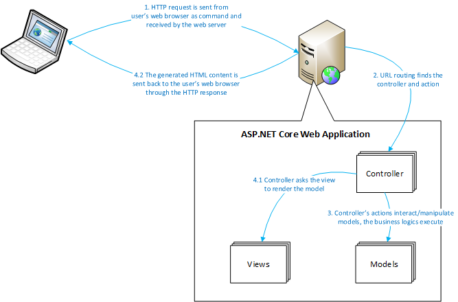

### ASP.NET Core Web应用程序的执行周期

要成为一名优秀的ASP.NET核心开发人员，您需要了解其执行周期。对您来说，设计，开发和调试高质量的Web应用程序至关重要。

ASP.NET Core在执行周期中有四个步骤：

1. **接收命令**：该命令是Web浏览器发送的HTTP请求。HTTP请求可以通过地址栏中的输入，通过单击超链接或通过提交表单等来启动。每个HTTP请求都带有用户意图的消息，并且将由ASP上的Web服务器处理。 NET Core应用程序是托管的。
2. **URL路由**：每个HTTP请求都包含一个URL，此URL指示哪个应用程序，哪个控制器以及哪个操作将处理该命令。如果URL路由找不到匹配的目标，则将发回*404 Not Found* HTTP响应。
3. **操作执行**：一旦命令被路由到其目标操作（控制器类的方法），操作将从HTTP请求中提取信息和数据并开始处理它。如果需要，模型将参与此步骤。
4. **查看渲染**：控制器中的操作触发视图引擎呈现特定视图（`.cshtml`文件）。名为Razor的视图引擎将生成最终的HTML内容，并且该内容将通过HTTP响应发送回用户的Web浏览器。该动作可以将模型对象传递给视图，如果是这样，并且基于渲染逻辑，模型对象携带的数据将被编织到HTML内容中并显示在用户的web浏览器中。

