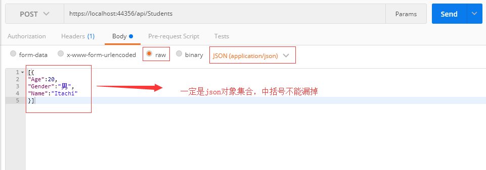

### HttpClient发送List<Object>参数

#### API代码

```
 public class Student
    {
        public Guid ID { get => new Guid(); }
        public string Name { get; set; }
        public int Age { get; set; }
        public string Gender { get; set; }
    }
    
     [HttpPost]
        public IActionResult Insert(List<Student> students)
        {
            if (students.Count > 0)
            {
                Students.AddRange(students);
                return Ok(Students);
            }
            return BadRequest("内容不能为空");
        }
```

#### Postman调试



### .NET客户端调用

```c#
 //这里用.NET Core Console App
 static async Task Main(string[] args)
        {
            using (HttpClient httpclient = new HttpClient())
            {
                List<Student> list = new List<Student>() {
                    new Student{ Age=18, Gender="女", Name="Sakura" },
                    new Student{ Age=25, Gender="女", Name="Hinata"},
                       new Student{ Age=18, Gender="女", Name="Sakura" },
                    new Student{ Age=25, Gender="女", Name="Hinata"},
                       new Student{ Age=17, Gender="女", Name="Sakura" }
                };
                StringContent content = new StringContent(JsonConvert.SerializeObject(list), Encoding.UTF8, "application/json");
                HttpResponseMessage message = await httpclient.PostAsync("https://localhost:44356/api/Students", content);
                if (message.IsSuccessStatusCode)
                {
                    List<Student> students = JsonConvert.DeserializeObject<List<Student>>(await message.Content.ReadAsStringAsync());
                    foreach (var item in students)
                    {
                        Console.WriteLine(item.Name + "——" + item.Age + "——" + item.Gender);
                    }
                    Console.WriteLine("列表总共"+students.Count+"条数据,"+"新增"+list.Count+"条");
                }
                else
                {
                    Console.WriteLine(await message.Content.ReadAsStringAsync());
                }
                Console.ReadKey();
            }
            Console.WriteLine("Hello World!");
        }
```

