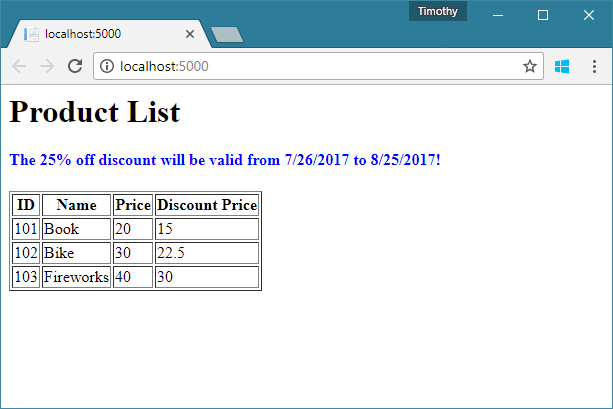

## Razor关键词

许多ASP.NET核心开发人员认为Razor视图中的可执行代码是C＃代码。这不是百分之百的真实。Razor有自己的关键字和语法解析系统。但为了缩小学习曲线，Razor确实借用了C＃的许多概念和关键词。

我们可以将Razor关键字分为两组：

1. **（纯）Razor关键字**：`model`，`functions`，`inherits`，`section`，`helper`
2. **C＃Razor关键字**：`using`，`for`，`foreach`，`if`，`else`，`while`，`do`，`switch`，`case`， `default`，`try`，`catch`，`finally`

注意：`helper`在ASP.NET MVC中可用，但在ASP.NET Core中不可用。

中关键字*（折纯）Razor关键字*组有相关意见特殊功能。您现在唯一需要了解的`model`关键字是关键字。此关键字设置*视图的视图模型类型*。重要的是要记住这一点，以便我们再次说明。它设置视图模型的TYPE。

回想一下，视图类的基类型是`Microsoft.AspNetCore.Mvc.Razor.RazorPage<TModel>`。该`model`关键字的功能是为通用视图类（TModel）设置类型参数。

在关键字*C＃Razor关键字*是从C＃借来的。它们在功能上与C＃关键字非常相似。例如，`foreach`。一旦你理解了其中任何一个，你就会理解其他人。您可以在[此处获取](https://docs.microsoft.com/en-us/aspnet/core/mvc/views/razor)包含代码示例的C＃Razor关键字的完整列表。

尽管C＃Razor关键字与C＃关键字非常相似，但仍然存在一些您应该注意的微小差异：

1. 您不需要`;`在语句，指令或表达式的末尾放置一个。例如，`using`指令和`model`前两行代码中的指令。
2. 它允许Razor表达式出现在它们的语句块中。例如，`@p.ID`并且`@p.Name`在`foreach`声明。

顺便说一句，您可以将`using`指令和`model`指令合并到一个指令中。它看起来像`@model MyWebApp.Models.ProductListVM`。

## C＃代码块

虽然不鼓励这样做，但如果你必须在视图中编写一些C＃代码，你可以用Razor C＃代码块编写它。一个Razor C＃代码块是一个`@`符号，后跟一对花括号`{}`。您可以拥有多个C＃代码块，但可以将C＃代码块视为模型类的实例构造函数。

并记住这一点：如果在C＃代码块中声明变量，它们将是视图级变量，类似于在类中声明一些实例字段。

到目前为止，Razor不支持在C＃代码块中声明函数。如果必须声明一些视图级别函数（如方法成员），则应使用`functions`块，例如：

```
@functions{
    string GetOffString(double rate) {
        var offStr = $"{(1 - rate) * 100}%";
        return offStr;
    }
}
```

## Razor表达

默认情况下，Razor引擎将所有文本识别为纯文本或HTML文本。在纯文本或HTML文本中，您可以嵌入Razor表达式。在渲染视图时将评估Razor表达式。我们知道，每个表达式都有一个结果值。结果值将取代Razor表达式，并成为最终HTML内容的一部分。例如，如果产品名称是`Rocket`，`<input id="name" name="name" value="@product.name"/>`则将渲染Razor代码`<input id="name" name="name" value="Rocket"/>`。

**Razor表达**是在由一对括号和铅的C＃表达`@`符号。看起来像这样`@( ... )`。

作为示例，`Given <b>r=5</b> and <b>h=10</b>, the volume of cylinder is <b>@(3.14*5*5*10)</b>.`视图中的代码最终将呈现为`Given <b>r=5</b> and <b>h=10</b>, the volume of cylinder is <b>785</b>.`

如果C＃表达式足够简单，则可以省略括号。例如，在代码中`<td>@p.ID</td><td>@p.Name</td><td>@p.Price</td><td>@(p.Price * rate)</td>`，我们可以省略前三个Razor表达式的括号，但我们必须保留最后一个括号。因为如果我们省略括号`@(p.Price * rate)`，当Razor引擎解析代码时`@p.Price * rate`，`* rate`将被识别为纯文本而不是评估为某个值的表达式。

注意：新的ASP.NET核心开发人员犯了两个常见错误：

1. `;`在Razor表达式后添加分号（）。
2. 使用Razor代码块（`@{ ... }`），其中应该有一个Razor表达式（`@( ... )`）。

对于上面的第一项，Razor引擎可以识别没有分号的Razor表达式。如果您在Razor表达式后意外添加分号，您将在最终呈现的HTML文本中看到分号。那是因为它被认为是纯文本。

对于第二项，您需要了解只有表达式生成值而语句不生成值。

我在这个单独的例子中结合了最常用的Razor语法元素。一旦理解了这个例子，你几乎可以理解80％的Razor语法。并且，基于此示例，我将在以下部分中解释其他Razor语法元素。

首先，我们假设我们有这三个模型类：

```
namespace MyWebApp.Models {
    public class Product {
        public int ID { get; set; }
        public string Name { get; set; }
        public double Price { get; set; }
    }

    public class Discount {
        public DateTime Start { get; set; }
        public DateTime End { get; set; }
        public double Rate { get; set; }
    }

    public class ProductListVM {
        public Discount Discount { get; set; }
        public IList<Product> Products { get; set; }
    }
}
```

很明显，`Product`而且`Discount`是域模型和`ProductListVM`一个视图模型（`VM`代表视图模型）。

呈现`ProductListVM`对象的视图是`ProductList.cshtml`。以下是此文件的代码：

```
@using MyWebApp.Models
@model ProductListVM

@{
    var start = this.Model.Discount.Start.ToString("d");
    var end = this.Model.Discount.End.ToString("d");
    var rate = this.Model.Discount.Rate;
    var off = (1 - rate) * 100;
}

<html>
<body>
<h1>Product List</h1>
<h4 style="color: blue">The @off% off discount will be valid from @start to @end!</h4>
<table border="1">
    <tr>
        <th>ID</th><th>Name</th><th>Price</th><th>Discount Price</th>
    </tr>
    @foreach (var p in this.Model.Products){
        <tr>
            <td>@p.ID</td><td>@p.Name</td><td>@p.Price</td><td>@(p.Price * rate)</td>
        </tr>
    }
</table>
</body>
</html>
```

要使用视图呈现视图模型，在控制器中我们有代码：

```
namespace MyWebApp.Controllers {
    public class ProductController : Controller {
        public IActionResult Index() {
            var vm = new ProductListVM();
            vm.Discount = new Discount { Start = DateTime.Today, End = DateTime.Today.AddDays(30), Rate = 0.75 };
            vm.Products = new List<Product>();
            vm.Products.Add(new Product { ID = 101, Name = "Book", Price = 20 });
            vm.Products.Add(new Product { ID = 102, Name = "Bike", Price = 30 });
            vm.Products.Add(new Product { ID = 103, Name = "Fireworks", Price = 40 });
            return View("ProductList", vm);
        }
    }
}
```

运行Web应用程序。您的浏览器将如下所示：




## 松散型模型视图

ASP.NET Core是一个开源项目，这意味着我们可以轻松获取其源代码。存储库的URL是<https://github.com/aspnet/Mvc>。

如果你跳到`Microsoft.AspNetCore.Mvc.Controller`课程的定义，你会看到：

```
namespace Microsoft.AspNetCore.Mvc {
    public abstract class Controller : /*base classes/interfaces*/ {

        [Dynamic]
        public dynamic ViewBag { get; }

        [ViewDataDictionary]
        public ViewDataDictionary ViewData { get; set; }

        // ... other members
    }
}
```

正如我们前面提到的，视图文件（.cshtml文件）中的代码将被转换为视图页面类。视图页面类之间的继承关系是`IRazorPage`- > `RazorPageBase`- >`RazorPage`- > `RazorPage<TModel>`- >您的视图页面类。

您可以发现该属性`public dynamic ViewBag { get; }`是在`RazorPageBase`类中定义的，并且`public ViewDataDictionary<TModel> ViewData { get; set; }`是在`RazorPage<TModel>`类中定义的。这意味着您的视图页面类具有这两个属性。

当一个动作调用该`View`方法来渲染视图时，Razor引擎将创建一个视图页面类的实例，然后将控制器`ViewBag`和`ViewData`属性的值分配给视图实例`ViewBag`和`ViewData`属性。

 

## 强类型模型视图

要呈现强类型视图模型，我们`@model`在视图文件的头部编写指令。例如，`@model MyWebApp.Models.ProductListVM`前一个示例中的指令。使用此指令，`Model`视图类的属性类型将设置为`ProductListVM`。在运行时，的值`Model`或者可以是一个实例`ProductListVM`，或者它可以是`null`。

`@model`指令的概念很简单。从.cshtml文件转换的视图页面类是从`RazorPage<TModel>`泛型类派生的。检查此类的代码作为示例：

```
namespace Microsoft.AspNetCore.Mvc.Razor
{
    public abstract class RazorPage<TModel> : RazorPage
    {
        public TModel Model { get; set; }

        // other members ...
    }
}
```

`@model`指令的类型只是`TModel`，`Model`属性的类型`TModel`也是。顺便说一句，如果视图没有`@model`指令，`TModel`则将设置为`System.Object`该类。

要为`Model`视图实例的属性设置值，我们将`model`参数传递给`View`方法。它看起来像这样：

```
public class YourController : Controller {
    public IActionResult YourAction() {
        var vm = /* create the instance of the view model */;
        // business logics ...
        return View("YourView", vm);
    }
}
```

如果您阅读源代码，您会发现`View`操作中调用的方法是这个重载版本：

```
[NonAction]
public virtual ViewResult View(string viewName, object model);
```

相应地，您可以`Model`在视图的代码中使用该属性。例如：

```
@foreach (var p in this.Model.Products){
    <tr>
        <td>@p.ID</td><td>@p.Name</td><td>@p.Price</td><td>@(p.Price * rate)</td>
    </tr>
}
```

您可以`Model`在视图代码中的任何位置访问该属性。通常，您会在以下位置看到对该`Model`物业的访问权限：

- 剃刀表达
- Razor关键字的陈述
- Razor C＃代码块中的语句
- Razor `functions`块中的函数定义

#### 奖金：区分`@model`和`@Model`

新的ASP.NET核心开发者很多被混淆`@model`和`@Model`。熟悉Razor语法后，您将理解`@model`引导设置视图模型*类型*的指令，而 `@Model`（或`@this.Model`）是`Model`对视图实例属性的访问。