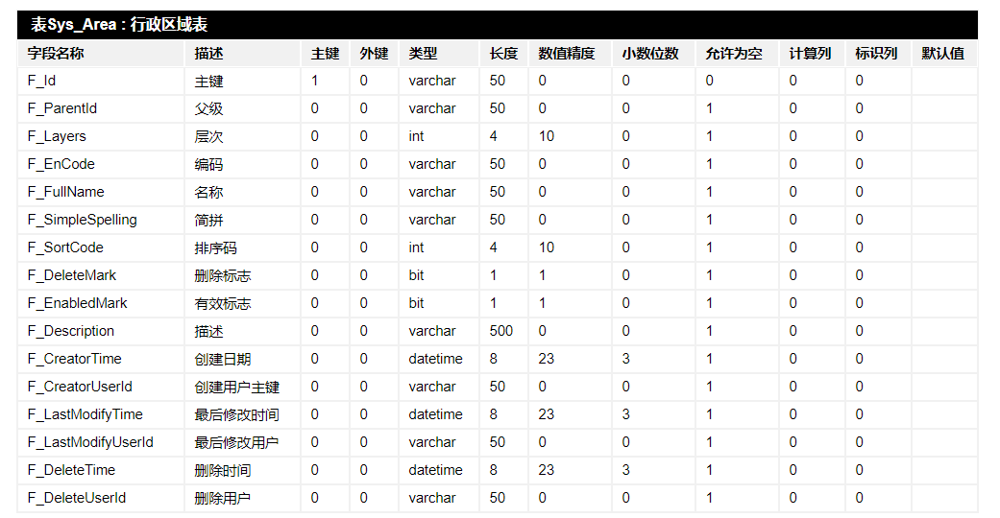
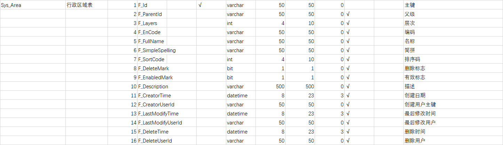

## SQL Server自动生成数据字典

####  生成数据字典并导出HTML
1. 复制粘贴下列SQL语句

```mssql
Set nocount on
DECLARE @TableName nvarchar(35)
DECLARE Tbls CURSOR
FOR
    Select distinct Table_name
    FROM INFORMATION_SCHEMA.COLUMNS
    --put any exclusions here
    --where table_name not like '%old'
    order by Table_name
OPEN Tbls
PRINT '<!DOCTYPE html>'
PRINT '<html lang="en">'
PRINT '<head>'
PRINT '<meta charset="UTF-8">'
PRINT '<meta name="viewport" content="width=device-width, initial-scale=1.0">'
PRINT '<meta http-equiv="X-UA-Compatible" content="ie=edge">'
PRINT '<title>数据库字典</title>'
PRINT '<style type="text/css">'
PRINT 'body{margin:0; font:11pt "arial", "微软雅黑"; cursor:default;}
.tableBox{margin:10px auto; padding:0px; width:1000px; height:auto; background:#FFF; border:1px solid #F1F1F1}
.tableBox h3 {font-size:12pt; height:30px; line-height:30px; background: #000000;; padding:0px 0px 0px 15px; color:#FFF; margin:0px; text-align:left }
.tableBox table {width:1000px; padding:0px }
.tableBox th {padding-left:10px;text-align: left;height:25px; border-top:1px solid #FFF; border-left:1px solid #FFF; background:#F1F1F1; border-right:1px solid #FFF; border-bottom:1px solid #FFF }
.tableBox td {height:25px; padding-left:10px; border-top:1px solid #F1F1F1; border-left:1px solid #F1F1F1; border-right:1px solid #F1F1F1; border-bottom:1px solid #F1F1F1 }'
PRINT '</style>'
PRINT '</head>'
PRINT '<body>'
FETCH NEXT FROM Tbls
INTO @TableName
WHILE @@FETCH_STATUS = 0
BEGIN
    PRINT '<div class="tableBox">'
    Select '<h3>表' + @TableName + ' : '+cast(Value as varchar(1000)) + '</h3>'
    FROM sys.extended_properties A
    WHERE A.major_id = OBJECT_ID(@TableName)
    and name = 'MS_Description' and minor_id = 0
    PRINT '<table cellspacing="0">'
    PRINT '<tr>' --Set up the Column Headers for the Table
    PRINT '<th>字段名称</th>'
    PRINT '<th>描述</th>'
    PRINT '<th>主键</th>'
    PRINT '<th>外键</th>'
    PRINT '<th>类型</th>'
    PRINT '<th>长度</th>'
    PRINT '<th>数值精度</th>'
    PRINT '<th>小数位数</th>'
    PRINT '<th>允许为空</th>'
    PRINT '<th>计算列</th>'
    PRINT '<th>标识列</th>'
    PRINT '<th>默认值</th>'
    --Get the Table Data
    SELECT '</tr><tr>',
    '<td>' + CAST(clmns.name AS VARCHAR(35)) + '</td>',
    '<td>' + ISNULL(CAST(exprop.value AS VARCHAR(500)),'') + '</td>',
    '<td>' + CAST(ISNULL(idxcol.index_column_id, 0)AS VARCHAR(20)) + '</td>',
    '<td>' + CAST(ISNULL(
    (SELECT TOP 1 1
    FROM sys.foreign_key_columns AS fkclmn
    WHERE fkclmn.parent_column_id = clmns.column_id
    AND fkclmn.parent_object_id = clmns.object_id
    ), 0) AS VARCHAR(20)) + '</td>',
    '<td>' + CAST(udt.name AS CHAR(15)) + '</td>' ,
    '<td>' + CAST(CAST(CASE WHEN typ.name IN (N'nchar', N'nvarchar') AND clmns.max_length <> -1
    THEN clmns.max_length/2
    ELSE clmns.max_length END AS INT) AS VARCHAR(20)) + '</td>',
    '<td>' + CAST(CAST(clmns.precision AS INT) AS VARCHAR(20)) + '</td>',
    '<td>' + CAST(CAST(clmns.scale AS INT) AS VARCHAR(20)) + '</td>',
    '<td>' + CAST(clmns.is_nullable AS VARCHAR(20)) + '</td>' ,
    '<td>' + CAST(clmns.is_computed AS VARCHAR(20)) + '</td>' ,
    '<td>' + CAST(clmns.is_identity AS VARCHAR(20)) + '</td>' ,
    '<td>' + isnull(CAST(cnstr.definition AS VARCHAR(20)),'') + '</td>'
    FROM sys.tables AS tbl INNER JOIN sys.all_columns AS clmns
    ON clmns.object_id=tbl.object_id
    LEFT OUTER JOIN sys.indexes AS idx
    ON idx.object_id = clmns.object_id
    AND 1 =idx.is_primary_key
    LEFT OUTER JOIN sys.index_columns AS idxcol
    ON idxcol.index_id = idx.index_id
    AND idxcol.column_id = clmns.column_id
    AND idxcol.object_id = clmns.object_id
    AND 0 = idxcol.is_included_column
    LEFT OUTER JOIN sys.types AS udt
    ON udt.user_type_id = clmns.user_type_id
    LEFT OUTER JOIN sys.types AS typ
    ON typ.user_type_id = clmns.system_type_id
    AND typ.user_type_id = typ.system_type_id
    LEFT JOIN sys.default_constraints AS cnstr
    ON cnstr.object_id=clmns.default_object_id
    LEFT OUTER JOIN sys.extended_properties exprop
    ON exprop.major_id = clmns.object_id
    AND exprop.minor_id = clmns.column_id
    AND exprop.name = 'MS_Description'
    WHERE (tbl.name = @TableName and
    exprop.class = 1) --I don't wand to include comments on indexes
    ORDER BY clmns.column_id ASC
    PRINT '</tr></table>'
    PRINT '</div>'
    FETCH NEXT FROM Tbls
    INTO @TableName
END
PRINT '</body></HTML>'
CLOSE Tbls
DEALLOCATE Tbls

```

2. 选择“以文本方式执行结果”（快捷键Ctrl+T），执行SQL，将文字复制粘贴，新建Html文件，将文字复制粘贴进去，浏览器中打开即可，效果如下



#### 生成数据字典，导出Excel

1. 执行一下SQL语句

```mssql
SELECT 
  表名=CASE   WHEN   A.COLORDER=1   THEN   D.NAME   ELSE   ''   END,     
  表说明=CASE   WHEN   A.COLORDER=1   THEN   ISNULL(F.VALUE,'')   ELSE   ''   END,     
  字段序号=A.COLORDER,     
  字段名=A.NAME,     
  标识=CASE   WHEN   COLUMNPROPERTY(   A.ID,A.NAME,'ISIDENTITY')=1   THEN   '√'ELSE   ''   END, 
  主键=CASE   WHEN   EXISTS(SELECT   1   FROM   SYSOBJECTS   WHERE   XTYPE='PK'   AND   NAME   IN   (     
  SELECT   NAME   FROM   SYSINDEXES   WHERE   INDID   IN(     
  SELECT   INDID   FROM   SYSINDEXKEYS   WHERE   ID   =   A.ID   AND   COLID=A.COLID     
  )))   THEN   '√'   ELSE   ''   END,     
  类型=B.NAME,     
  占用字节数=A.LENGTH,     
  长度=COLUMNPROPERTY(A.ID,A.NAME,'PRECISION'),     
  小数位数=ISNULL(COLUMNPROPERTY(A.ID,A.NAME,'SCALE'),0),     
  允许空=CASE   WHEN   A.ISNULLABLE=1   THEN   '√'ELSE   ''   END,     
  默认值=ISNULL(E.TEXT,''),     
  字段说明=ISNULL(G.[VALUE],'')     
  FROM   SYSCOLUMNS   A     
  LEFT   JOIN   SYSTYPES   B   ON   A.XTYPE=B.XUSERTYPE     
  INNER   JOIN   SYSOBJECTS   D   ON   A.ID=D.ID     AND   D.XTYPE='U'   AND     D.NAME<>'DTPROPERTIES'     
  LEFT   JOIN   SYSCOMMENTS   E   ON   A.CDEFAULT=E.ID     
  LEFT   JOIN   SYS.EXTENDED_PROPERTIES G   ON   A.ID=G.MAJOR_ID   AND   A.COLID=G.MINOR_ID     
  LEFT   JOIN   SYS.EXTENDED_PROPERTIES F   ON   D.ID=F.MAJOR_ID   AND   F.MINOR_ID   =0     
  --WHERE   D.NAME='要查询的表'   --如果只查询指定表,加上此条件     
  ORDER   BY   A.ID,A.COLORDER     

```

2. 执行后将结果复制，新建Excel将内容粘贴即可，效果如下图

