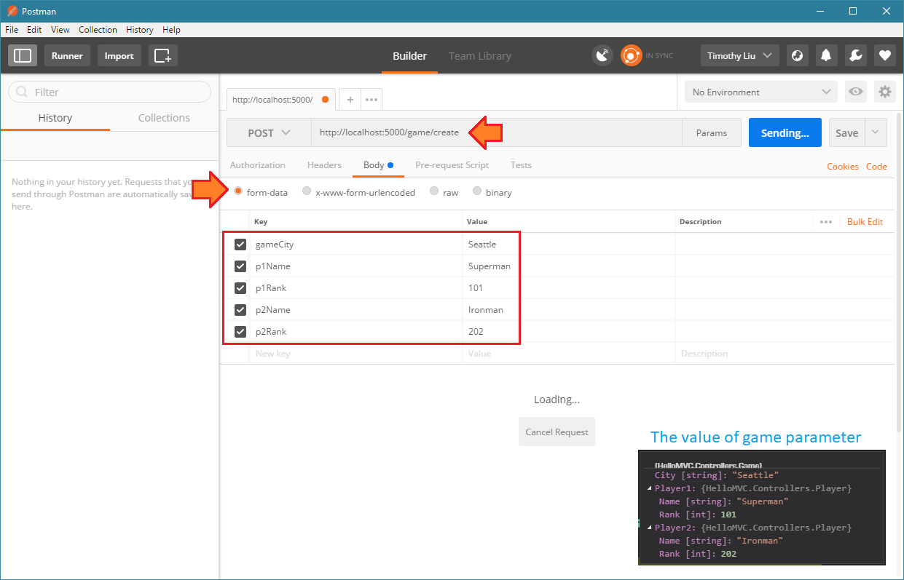

## 从URL中提取数据

在较旧的Web应用程序开发范例中，例如ASP.NET或Java Server Pages（JSP），要从HTTP请求中提取用户发送的数据，我们必须从HTTP头中读取数据，路由字符串（URL字符串） ），HTTP查询字符串或形成正文。这是一项繁琐的工作，每次HTML元素更改其名称时，读取数据的服务器端代码都必须相应地更改。

对于action方法，我们将HTTP请求视为模型绑定的数据源。下表显示了我们如何从HTTP请求中提取数据：

| 数据部分              | HTTP方法  | 使用频率 | 数据格式    | 如何提取                   |
| --------------------- | --------- | -------- | ----------- | -------------------------- |
| **请求参数**          | GET，POST | 高       | 名称 - 值对 | 将查询字符串视为字典       |
| **形式身体**          | POST      | 高       | 名称 - 值对 | 将表单数据视为字典         |
| **路由（URL字符串）** | GET，POST | 中       | 普通字符串  | 解析字符串或使用正则表达式 |
| **HTTP标头**          | GET，POST | 低       | 名称 - 值对 | 将HTTP标头视为字典         |

在ASP.NET Core中，模型绑定的功能是自动执行此解析工作，以便将HTTP请求中包含的数据映射到操作参数。这个概念很简单：

- 对于简单类型（int，double，string等）动作参数，模型绑定引擎以不区分大小写的方式通过参数的名称查询所有数据部分。如果存在名称 - 值对或者可以从URL字符串中提取值，则将值分配给参数。
- 对于复杂类型（产品，电影等）动作参数，模型绑定引擎以不区分大小写的方式通过参数的属性名称查询所有数据部分。如果存在名称 - 值对或者可以从URL字符串中提取值，则将该值分配给参数的属性。

由于HTTP请求中的所有值都是`string`类型，因此模型绑定将为我们执行类型转换。例如，在将名称 - 值对`price=99.99`映射到操作的`double price`参数之后，通过模型绑定引擎，`price`参数将获得double类型值`99.99`。但是如果转换失败会发生什么？`price=ABC`例如，如果名称 - 值对是参数和名称 - 值对的名称匹配，则由于类型转换失败，参数`price`将获得`0.0`（其类型的默认值`double`）。

让我们用一个代码示例来包装它：

假设我们的Web应用程序正在运行，`http://localhost:5000`其默认路由模板是`{controller=Home}/{action=Index}/{id?}`。域模型类`Product`如下所示：

```
public class Product {
    public int ID { get; set; }
    public string Name { get; set; }
    public double Price { get; set; }
    public string MadeIn { get; set; }
    public bool IsAvailable { get; set; }
    public string Description { get; set; }
}
```

该`ProductController`如下所示：

```
public class ProductController : Controller {
    [HttpPost]
    public IActionResult Create(Product product) {
        // business logic ...
        return View(product);
    }
}
```

当Web客户端向URL发起HTTP POST请求`http://localhost:5000/product/create/101?isavailable=false&madein=USA`时，表单主体中的数据为：

```
name=Autopilot Car
price=99999.99
```

`product`参数的值是对`Product`模型绑定创建的类型对象的引用。其属性值为：

| 属性            | 类型   | 值              | 取自         | 提取者       |
| --------------- | ------ | --------------- | ------------ | ------------ |
| **ID**          | int    | 101             | URL          | 路由模板解析 |
| **IsAvailable** | bool   | false           | query string | 名称匹配     |
| **MadeIn**      | string | “USA”           | query string | 名称匹配     |
| **Name**        | string | "Autopilot Car" | form data    | 名称匹配     |
| **Price**       | double | 99999.99        | form data    | 名称匹配     |
| **Description** | string | null            | not found    | –            |

由于这是一个极端的例子，请注意在实际项目中，我们很少将对象的值分配给这么多部分。在Web应用程序中传输数据的简单原则是：

- 对于HTTP GET请求，请使用URL字符串或查询字符串来传输数据
- 对于HTTP POST请求，请使用表单传输数据
- 仅在必要时将数据分发到不同的部分
- 如果你想限制数据源,使用`[FromQuery]`，`[FromForm]`，`[FromRoute]`和`[FromHeader]`修改动作的参数

## 自定义模型绑定器

虽然模型绑定可以将HTTP请求中包含的数据映射到操作参数，但如果操作参数的类型过于复杂，则模型绑定引擎将无法创建该对象。例如，如果我们有域模型类：

```
public class Player {
    public string Name { get; set; }
    public int Rank { get; set; }
}

public class Game {
    public string City { get; set; }
    public Player Player1 { get; set; }
    public Player Player2 { get; set; }
}
```

并且，表单主体中的名称 - 值对是：

```
p1Name=Superman
p1Rank=101
p2Name=Ironman
p2Rank=202
gameCity=Seattle
```

模型绑定引擎如何`Game`使用此数据构建对象？

在这种情况下，我们需要一个自定义模型绑定器。自定义模型绑定器是实现`IModelBinder`接口的类。对象的完成的自定义模型绑定器`Game`将如下所示：

```
public class GameModelBinder : IModelBinder {
    public Task BindModelAsync(ModelBindingContext bindingContext) {
        var game = new Game();
        game.Player1 = new Player();
        game.Player2 = new Player();
        game.City = bindingContext.HttpContext.Request.Form["gameCity"];
        game.Player1.Name = bindingContext.HttpContext.Request.Form["p1Name"];
        game.Player1.Rank = int.Parse(bindingContext.HttpContext.Request.Form["p1Rank"]);
        game.Player2.Name = bindingContext.HttpContext.Request.Form["p2Name"];
        game.Player2.Rank = int.Parse(bindingContext.HttpContext.Request.Form["p2Rank"]);
        bindingContext.Result = ModelBindingResult.Success(game); // set the model binding result
        return TaskCache.CompletedTask;
    }
}
```

请注意，为了使代码简洁明了，我们省略了大量的数据验证代码，极端情况和异常处理。在实际项目中，自定义模型绑定器不会那么简单。

有两种方法可以使用它`GameModelBinder`。第一种方法是用`Game`类修改类`[ModelBinder(BinderType = typeof(GameModelBinder))]`。除非您保证`Game`始终从表单主体构建对象，否则建议您不要使用此方法。

第二种方法更灵活。我们使用该属性`[ModelBinder(BinderType = typeof(GameModelBinder))]`来修改action参数：

```
public class GameController : Controller {
    public IActionResult Create([ModelBinder(BinderType = typeof(GameModelBinder))]Game game) {
        // business logic ...
        return View(game);
    }
}
```

要触发此操作并观察参数的值，我们可以在操作中设置断点并使用Postman启动HTTP POST请求。以下是截图供参考：

